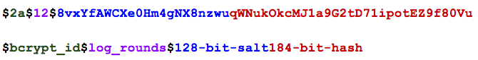

# Hash Tables and Security

## How Not to Store Passwords

1. Bad Solution 1: Plain text password

    - So hackable.

2. Bad Solution 2: Encryption [`sha1(password), md5(password)`]

    - Very open to brute force and rainbow tables.
    - When multiple users use the same password, all will get hacked if one can be cracked because encrypted strings will be the same.

3. Bad Solution 3: Encryption with Fixed Salt [`sha1(FIXED_SALT + password)`]

    - Fixed salts are extremely risky.

4. Bad Solution 4: Encryption with Per User Salt [`sha1(PER_USER_SALT + password)`]

    - Storing salts in the DB is risky.

5. Hashing

    - It can even be cracked with a simple Google search if it's a simple algorithm. Again, quite open to brute force and rainbow table attacks.

## How to Store Passwords

  - Hashing + salting.

  - A salt is a random string, unique for each user. So even if two different users use the same password they won't be hacked together if one of their passwords got hacked, simply because their hash strings will be different. However, this method still doesn't protect passwords from bruteforce attacks. So it's an effective way to stop rainbow table attacks, but not to bruteforce.

## Bcrypt

- Bcrypt works like that:

    ```ruby
    hash(salt + just_entered_password)
    ```

- Bcrypt has designed to work slow! For example, let's say during a fixed amount of time (N), an attacker can generate 150.000 MD5 hash strings - but he/she will only gonna be able to generate 500 bcrypt hash strings in the same time period (N). In order words, generating a hash string for bcrypt is 300 times slower than MD5. This makes it impossible to generate rainbow table for bcrypt.

- But wait, if bcrypt generates the salt randomly, how do we compare hash strings during the login time? Since we can't generate a random thing again.

- BCrypt defines its own `==` method, which knows how to extract that "salt" value so that it can take that into account when comparing the passwords. Bcrypt is not an encryption algorithm, it is a hashing algorithm. You cannot reverse a hash. For example if the hashing algorith uses modulus somehow, it's almost impossible to reverse it, since modulus of many numbers are the same (ie. modulus of 1000 and 100).

  

- Bcrypt places the random salt into the hash string, so there is no need to store salt anywhere else. The function embedded into bcrypt already knows how to extract the salt from the hash string.

- Resource: http://dustwell.com/how-to-handle-passwords-bcrypt.html
