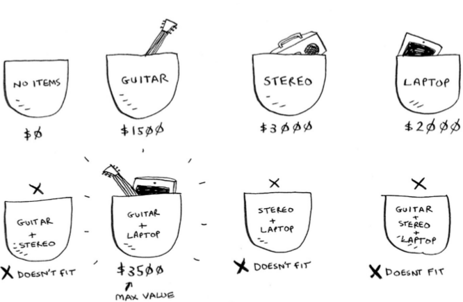
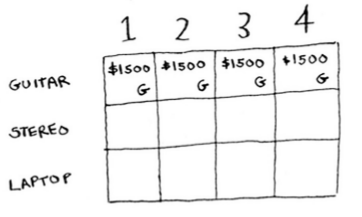
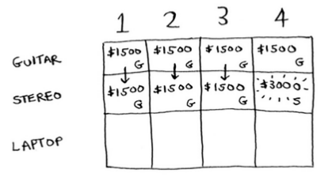
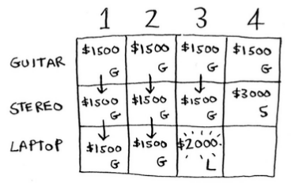
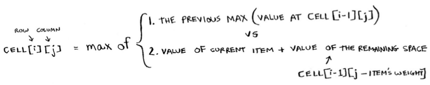

# The Knapsack Problem

You have three items that you can put into the knapsack.

What items should you steal so that you steal the maximum money's worth of goods? The simplest algorithm is this: you try every possible set of goods and find the set that gives you the most value.

This works, but it's really slow. For 3 items, you have to calculate 8 possible sets. For 4 items, you have to calculate 16 sets. With every item you add, the number of sets you have to calculate doubles! This algorithm takes `O(2^n)` time, which is very, very slow.

In chapter 8, you saw how to calculate an approximate solution. That solution will be close to the optimal solution, but it may not be the optimal solution. So how do you calculate the optimal solution?

## Dynamic programming

Answer: With dynamic programming! Let's see how the dynamic-programming algorithm works here. Dynamic programming starts by solving subproblems and builds up to solving the big problem.

For the knapsack problem, you'll start by solving the problem for smaller knapsacks (or "sub-knapsacks") and then work up to solving the original problem.

**Every dynamic-programming algorithm starts with a grid.** Here's a grid for the knapsack problem:

The grid starts out empty. You're going to fill in each cell of the grid. Once the grid is filled in, you'll have your answer to this problem!

### The guitar row

This is the guitar row, which means you're trying to fit the guitar into the knapsack. At each cell, there's a simple decision: **do you steal the guitar or not?**

The first cell has a knapsack of capacity 1 lb. The guitar is also 1 lb, which means it fits into the knapsack! So the value of this cell is $1,500, and it contains a guitar.

Like this, each cell in the grid will contain a list of all the items that fit into the knapsack at that point. Let's look at the next cell. Here you have a knapsack of capacity 2 lb. Well, the guitar will definitely fit in there! The same for the rest of the cells in this row.

### The stereo row

Now that you're on the second row, you can steal the stereo or the guitar. At every row, you can steal the item at that row or the items in the rows above it. So you can't
choose to steal the laptop right now, but you can steal the stereo and/or the guitar. Let's start with the first cell, a knapsack of capacity 1 lb.

You have a knapsack of capacity 1 lb. Will the stereo fit in there? Nope, it's too heavy! Because you can't fit the stereo, $1,500 remains the max guess for a 1 lb knapsack.

What if you have a knapsack of capacity 4 lb? Aha: the stereo finally fits! The old max value was $1,500, but if you put the stereo in there instead, the value is $3,000! Let's take the stereo.

You just updated your estimate! If you have a 4 lb knapsack, you can fit at least $3,000 worth of goods in it.

### The laptop row

Let's do the same thing with the laptop! The laptop weighs 3 lb, so it won't fit into a 1 lb or a 2 lb knapsack. The estimate for the first two cells stays at $1,500. At 3 lb, the old estimate was $1,500. But you can choose the laptop instead, and that's worth $2,000. So the new max estimate is $2,000! At 4 lb, things get really interesting. This is an important part. The current estimate is $3,000. You can put the laptop in the knapsack, but it's only worth $2,000.

Hmm, that's not as good as the old estimate. But wait! The laptop weighs only 3 lb, so you have 1 lb free! You could put something in this 1 lb.

What's the maximum value you can fit into 1 lb of space? Well, you've been calculating it all along.

According to the last best estimate, you can fit the guitar into that 1 lb space, and that's worth $1,500. So the real comparison is as follows:

    3000$ Stereo VERSUS (2000$ Laptop + 1500$ Guitar)?

You might have been wondering why you were calculating max values for smaller knapsacks. I hope now it makes sense! When you have space left over, you can use the answers to those subproblems to figure out what will fit in that space.

Here is the formula for this problem:

## The Knapsack Problem FAQ

- Can you steal fractions of an item?

    You can't. With the dynamic-programming solution, you either take the item or not. There's no way for it to figure out that you should take half an item.

- Handling items that depend on each other. Suppose you want to go to Paris, so you add a couple of items on the list. These places take a lot of time, because first you have to travel from London to Paris. That takes half a day. If you want to do all three items, it will take four and a half days. Wait, that's not right. You don't have to travel to Paris for each item. Once you're in Paris, each item should only take a day. So it should be one day per item + half a day of travel = 3.5 days, not 4.5 days. If you put the Eiffel Tower in your knapsack, then the Louvre becomes "cheaper" — it will only cost you a day instead of 1.5 days. How do you model this in dynamic programming?

    You can't. Dynamic programming is powerful because it can solve subproblems and use those answers to solve the big problem. Dynamic programming only works when each subproblem is discrete—when it doesn't depend on other subproblems. That means there's no way to account for Paris using the dynamic-programming algorithm.

# Longest Common Substring

You've seen one dynamic programming problem so far. What are the takeaways?

- Dynamic programming is useful when you're trying to optimize something given a constraint. In the knapsack problem, you had to maximize the value of the goods you stole, constrained by the size of the knapsack.

- You can use dynamic programming when the problem can be broken into discrete subproblems, and they don't depend on each other.

It can be hard to come up with a dynamic-programming solution. That's what we'll focus on in this section. Some general tips follow:

- Every dynamic-programming solution involves a grid.
- The values in the cells are usually what you're trying to optimize. For the knapsack problem, the values were the value of the goods.
- Each cell is a subproblem, so think about how you can divide your problem into subproblems. That will help you figure out what the axes are.

Computer scientists sometimes joke about using the **Feynman algorithm**. The Feynman algorithm is named after the famous physicist Richard Feynman, and it works like this:

1. Write down the problem.
2. Think real hard.
3. Write down the solution.

So is dynamic programming ever really used? Yes:

- Longest common subsequence and longest common substring are examples of dynamic programming, which can be solved with a grid.

- Biologists use the longest common subsequence to find similarities in DNA strands. They can use this to tell how similar two animals or two diseases are. The longest common subsequence is being used to find a cure for multiple sclerosis.

- Have you ever used diff (like git diff )? Diff tells you the differences between two files, and it uses dynamic programming to do so.

- We talked about string similarity. Levenshtein distance measures how similar two strings are, and it uses dynamic programming. Levenshtein distance is used for everything from spell-check to figuring out whether a user is uploading copyrighted data.

- Have you ever used an app that does word wrap, like Microsoft Word? How does it figure out where to wrap so that the line length stays consistent? Dynamic programming!
