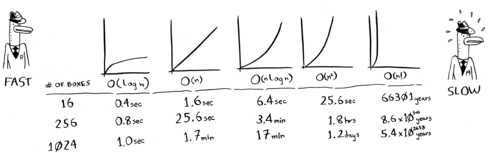
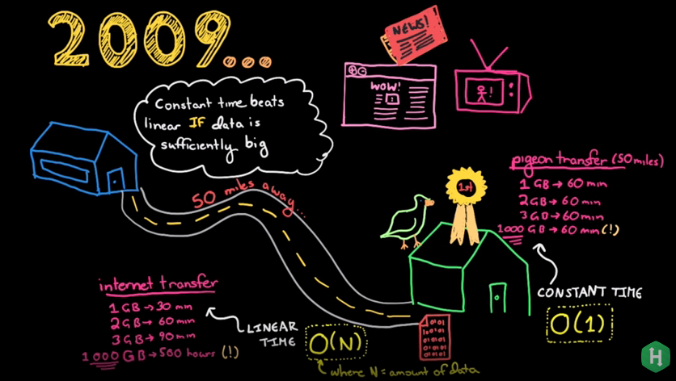
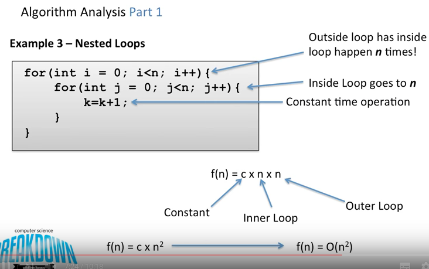
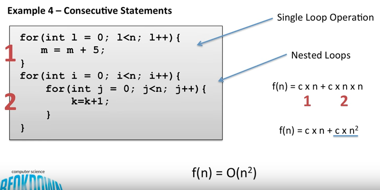

# Big-o-notation

- Big-o-notation is a special notation that tells you how fast an algorithm is.

- Simple search needs to check each element, so it will take **n** operations. The run time in Big O notation is **O(n)**.

- Binary search needs **log(n)** operations to check a list of size n. Running time in Big O notation is **O(log n)**.

- Big O will not tell you anything about how long it will take, it will only tell you how fast the algorithm grows, in other words how your algorithm scales.

- Big O always considers the worst case. If you are lucky, you can find the value that we you searching for even in the first try, but Big(O) always considers the worst case. Omega(n) considers the best case, and Theta(n) considers the average case.

  

## Some Common Big O Run Times

- O(logn), also known as log time. Binary search.
- O(n), also known as linear time. Simple search.
- O(n * logn). A fast sorting algorithm like quicksort.
- O(n2). A slow sorting algorithm like selection sort.
- O(n!). A really slow algorithm like traveling salesperson.

## Summary

- Algorithm speed isn't measured in seconds, but in growth of the number of operations.
- It says how time scales with respect to some variables.
- We talk about how quickly the run time of an algorithm increases as the size of the input increases.
- Run time of algorithms is expressed in Big O notation.

# Pigeon and Internet Example

# Algorithm Analysis

