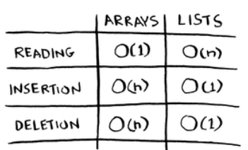
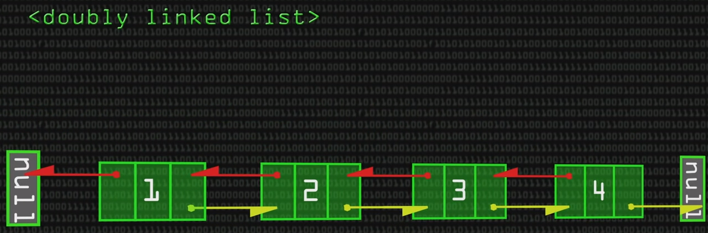

## Arrays and Linked Lists

- Array için tüm array'in sığabileceği bir memory bloğuna ihtiyacımız var. Yani array'in tümü bir memory bloğunda tutulacak, bir kısmı bir bellek adresinde - diğer kısmı başka bir bellek adresinde tutulmayacak. Linked list'te ise her bir eleman belleğin farklı yerlerinde tutulabilir, her bir eleman ise kendisinden sonra gelen elemanın konumunu bilir (pointer).

- Bu aynı sinemaya arkadaş grubu olarak gitmek gibi. Array'i ele alacak olursak tüm arkadaşlar yanyana oturmak istiyor, linked list'i ele alırsak arkadaşlar ayrı ayrı oturmayı kabul ediyor ve herkes kendinden sonra kimin geldiğini biliyor diyebiliriz.

- Bu yüzden de array'e yeni eleman eklemek ve array'den eleman çıkarmak bir sorun. Her bir ekleme çıkarma işleminde yine uygun bir bellek alanı bulunması gerekiyor. Yine sinemadan örnek verirsek, salonun A sırasında 7 tane yanyana boş koltuk var ancak bir arkadaşımız daha bize katıldı - dolayısıyla artık 8 tane yanyana boş koltuğa ihtiyacımız oldu ve bunun D sırasında bulursak hepimiz oraya geçmek zorundayız.

- Buna çözüm olarak koltuk tutmayı önerebiliriz. Örneğin 7 kişi olsakta 10 tane yanyana koltuğu satın almak gibi. Peki bunun dezavantajı nedir? Eğer başka arkadaş gelmezse 3 koltuk boşa gitmiş olacak (memory waste).

- Bu üç koltuğu kendimiz kullanmadığımız gibi, başkasına da kullandırmamış olacağız.

- Biz 10 koltuk aldık ama ya 6 arkadaşımız daha bize katılmaya karar verirse? Yine başka yer aramak zorunda kalacağız.

- Linked list'te her bir eleman kendinden sonra gelen elemanın konumunu biliyor - yani birden fazla memory address'i birbirine linkliyoruz.

- Linked list'lere eleman eklemek veya eleman çıkartmak kolay. Peki linked list'ler insert'te bu kadar başarılı ise array'ler niye var, onlara ne gerek var? Array'lerde arama yapmak veya bir elemanın değerini döndürmek linked list'lere göre çok daha kolaydır. Sinema örneğinden gidecek olursak salonda en arkada oturan arkadaşımızın kim olduğunu bilmiyoruz. Onu bulabilmek için önce yerini bildiğimiz arkadaşımıza (bizden bir sonraki ) gideceğiz, o kendinden sonrakini, o kendinden sonrakini söyleyecek ve sonuncu arkadaşımızı bulmuş olacağız. Array'de bütün elemanların adresini (index) bildiğimiz için bir elemana ulaşmak çok daha kolay.

## Terminology

- Here are run times for common operations on arrays and lists:

  

  ```
  O(n) -> Linear time
  O(1) -Z Constant time
  ```

## Inserting into the middle of a list

- **Lists** are better if you want to insert elements into the middle. If you use arrays for inserting into middle, the memory have to shift the remaining elements of the array.

## Deletions

- **Lists** are better when it comes to deletion, because you just need to change what the previous element points to. With arrays, everything needs to be moved up when you delete an element.

- Unlike insertions, deletions will always work. Insertions can fail sometimes when there is no space left in memory. But you can always delete an element.

- Here are the run times for common operations on arrays and linked lists:

  

- Which are used more? Arrays or lists? Arrays see a lot of use because they allow random access. There are two types of access: **random access** and **sequential access**.

- **Sequential access** means reading the elements one by one, starting at the first element. Linked lists can only do sequential acess. If you want to read the 10th element of a linked list, you have to read the first 9 elements and follow the links to the 10th element.

- **Random access** means you can jump directly to the 10th element. Arrays provide random access, therefore they are faster at reading.

## Excersise

- Facebook uses neither an array nor a linked list to store user information. Let’s consider a hybrid data structure: an array of linked lists. You have an array with 26 slots. Each slot points to a linked list. For example, the first slot in the array points to a linked list containing all the usernames starting with a. The second slot points to a linked list containing all the usernames starting with b, and so on.

  

- Question: Suppose Adit B signs up for Facebook, and you want to add them to the list. You go to slot 1 in the array, go to the linked list for slot 1, and add Adit B at the end. Now, suppose you want to search for Zakhir H. You go to slot 26, which points to a linked list of all the Z names. Then you search through that list to find Zakhir H. Compare this hybrid data structure to arrays and linked lists. Is it slower or faster than each for searching and inserting? You don’t have to give Big O run times, just whether the new data structure would be faster or slower.

- Answer: Searching—slower than arrays, faster than linked lists. Inserting—faster than arrays, same amount of time as linked lists. So it’s slower for searching than an array, but faster or the same as linked lists for everything.

## Gotcha

- Eğer ilk elemana erişmek istiyorsak array ve linked-list'in hızı aynıdır. Çünkü linked-list'te dolaşmak, pointer'ları takip etmek zorunda olmayacağız. Ancak random bir elemana erişmek istiyorsak array daha hızlı çünkü neyin nerede olduğunu biliyoruz.
- When we create an array, the computer allocates a memory block, it doesn't for linked-list.
- The last node in a linked-list is NULL! So our program doesn't crash when it looks to the last item.
- Linked list'in ortasına bir eleman eklediğimizde bir tane link'i kırmamız, iki tane yeni link oluşturmamız yeterli. Array'de ise epeyce bir elemanı kaydırmamız gerekecek.
- Doubly linked lists have two different pointers to forward and backward:

  

  
