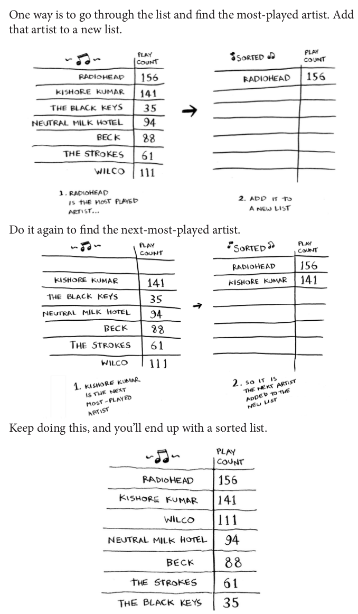
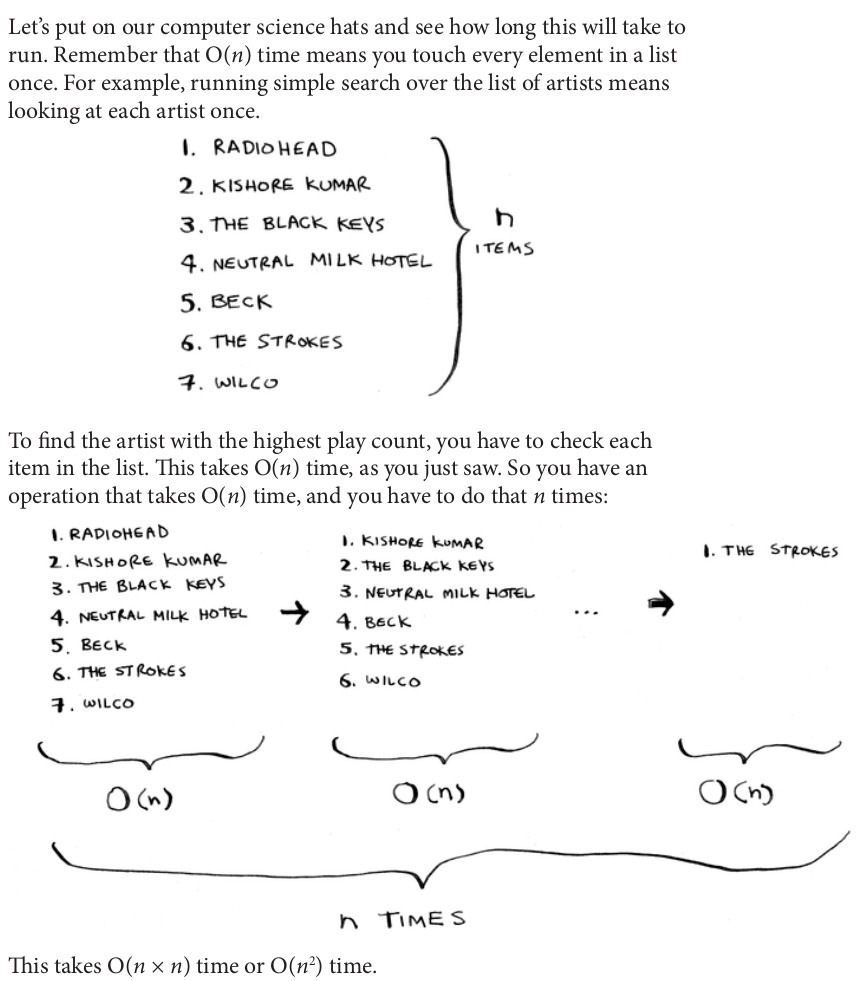

## Selection Sort

- Selection sort takes O(n2) time.
- Aslında n*(n+1)/2 ama biz sabitlerle ilgilenmediğimiz için **n2**

- Selection sort is a neat algorithm, but it’s not very fast. Quicksort is a faster sorting algorithm that only takes **O(n logn)** time. It’s coming up in the next chapter!
