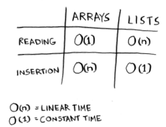
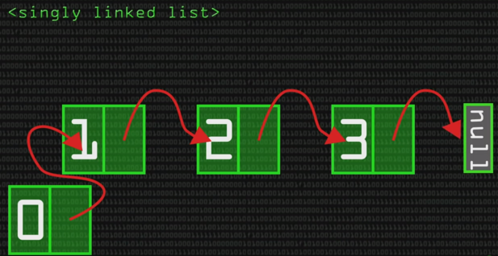

# Arrays and Linked Lists

Arrays need a memory block that the whole array can fit. In order words, the whole array needs to be stored in a single memory block, and can't be distributed between multiple memory blocks. On the other hand, linked lists can be stored in different memory blocks since each array element knows the location of the next element (pointer) in the array.

This can be explained with a "going to the cinema with friends" analogy. In the array scenario, all friends would like to sit together, while in linked list scenario, group members would like to sit separately however each member knows the location of the next member in cinema.

That's why adding or removing an element from an array isn't cheap. Each addition or removal requires finding of a suitable block in the memory. Let's say you are a group of 7 and you are sitting in a line with 7 seats together. If an another friend joins you, you will all have to move to another line together, and you will also need a line with 8 empty seats.

As a solution to this problem, reserving seats might be offered. For example, buying 10 seats, instead of 7 will guarantee that 3 more people can join to the group. This approach has 2 main disadvantages. First, it's gonna be much more expensive, and second if the expected friends don't join you, you will still be blocking 3 seats for no reason. In terms of memory usage, you are gonna be wasting memory, and you will be blocking other processes from using the available memory.

On the other hand, this approach isn't feasiable. What is 6 more friends decide to join you? What if 10 more? When the amount of possible joiners isn't known, this approach can't really work.

Adding or removing from a linked list is much more easier, since each item only knows the address of the next item in the list. Then, if linked-lists are so great, why do arrays exist at all? The unique advantage of an array becomes more visible when you search an element. For example, it's easy to find 6th element in array because of indexes, however you would have to start from the first item and follow all the links for a linked list.

## Terminology

- Here are run times for common operations on arrays and lists:

  

  ```
  O(n) -> Linear time
  O(1) -> Constant time
  ```

## Inserting into the middle of a list

- **Lists** are better if you want to insert elements into the middle. If you use arrays for inserting into middle, the memory have to shift the remaining elements of the array.

## Deletions

- **Lists** are better when it comes to deletion, because you just need to change what the previous element points to. With arrays, everything needs to be moved up when you delete an element.

- Unlike insertions, deletions will always work. Insertions can fail sometimes when there is no space left in memory. But you can always delete an element.

- Here are the run times for common operations on arrays and linked lists:

  

- Which are used more? Arrays or lists? Arrays see a lot of use because they allow random access. There are two types of access: **random access** and **sequential access**.

- **Sequential access** means reading the elements one by one, starting at the first element. Linked lists can only do sequential acess. If you want to read the 10th element of a linked list, you have to read the first 9 elements and follow the links to the 10th element.

- **Random access** means you can jump directly to the 10th element. Arrays provide random access, therefore they are faster at reading.

## Exercise

- Facebook uses neither an array nor a linked list to store user information. Let's consider a hybrid data structure: an array of linked lists. You have an array with 26 slots. Each slot points to a linked list. For example, the first slot in the array points to a linked list containing all the usernames starting with a. The second slot points to a linked list containing all the usernames starting with b, and so on.

  

- Question: Suppose Adit B signs up for Facebook, and you want to add them to the list. You go to slot 1 in the array, go to the linked list for slot 1, and add Adit B at the end. Now, suppose you want to search for Zakhir H. You go to slot 26, which points to a linked list of all the Z names. Then you search through that list to find Zakhir H. Compare this hybrid data structure to arrays and linked lists. Is it slower or faster than each for searching and inserting? You don't have to give Big O run times, just whether the new data structure would be faster or slower.

- Answer: Searching—slower than arrays, faster than linked lists. Inserting—faster than arrays, same amount of time as linked lists. So it's slower for searching than an array, but faster or the same as linked lists for everything.

## Summary

- When accessing to the first element, the speed of array and linked list is the same since we don't need to follow all the pointers between linked-list items. However, for any other item, array is gonna be faster.
- When we create an array, the computer allocates a memory block, it doesn't for linked-list.
- The last node in a linked-list is NULL! So our program doesn't crash when it looks to the last item.
- Adding an item in the middle of a linked-list is just a matter of breaking a link, and creating a new one. However, adding an item in the middle of a linked-list will require a complete shift.
- Doubly linked lists have two different pointers to forward and backward:

  

  
