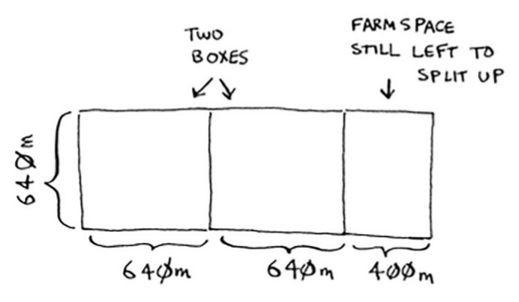
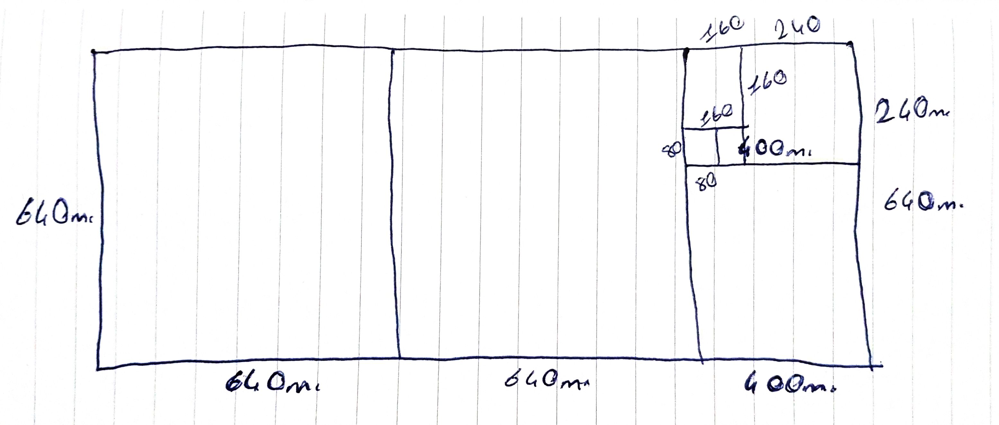

## Divide and Conquer

- D&C algorithms are recursive algorithms. To solve a problem using D&C, there are two steps:

  1. Figure out the base case. This should be the simplest possible case.
  1. Divide or decrease your problem until it becomes the base case.

### Question

- Elimizde 1680 x 640 metrelik bir tarla var. Bu tarlayı birbiriyle eşit karelere ayırmak istiyoruz. Aynı zamanda ise olabilecek en büyük kare alanlarını istiyoruz, yani tarlayı birbiriyle eş en az kaç kareye bölebiliriz bunu bulmak istiyoruz.

  

- Stratejimizi hatırlayalım. Önce base case'i bulmalıyız. Bu base case olası en basit durum olmalı. Daha sonra problemi bu base case'i kullanarak daha küçük parçalara böleceğiz ve sonunda ulaştığımız durum bizim yeni base case'imiz olacak.

- First, figure out the base case. The easiest case would be if one side was a multiple of the other side.

  

- You can fit two 640×640 boxes in there, and there's some land still left to be divided. Now here comes the "Aha!" moment. There's a farm segment left to divide. Why don't you apply the same algorithm to this segment? So we recursively continue splitting the are into maximum possible boxes, we get 80 as the lenght of a box.

  

- Euclid's algorithm is the proof of divide and conquer.

## Sneak Peak at Functional Programming

- "Why would I do this recursively if I can do it easily with a loop?" you may be thinking. Well, this is a sneak peek into functional programming!

- Functional programming languages like Haskell don’t have loops, so you have to use recursion to write functions like this. If you have a good understanding of recursion, functional languages will be easier to learn.
