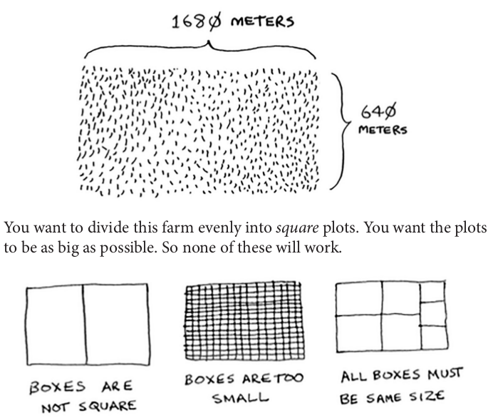

# Divide and Conquer

D&C algorithms are recursive algorithms. To solve a problem using D&C, there are two steps:

  1. Figure out the base case. This should be the simplest possible case.
  1. Divide or decrease your problem until it becomes the base case.

## Question

- How many equal squares can you split a 1680x640 field, by using minimum number of squares? In other words, target for the maximum square size.

  

- First we need to find the base case. The case has to be the simplest possible case. Then you'll have to divide the problem into multiple easier pieces by using the base case, in the end the situation we reach will be our new base case.

- First, figure out the base case. The easiest case would be if one side was a multiple of the other side.

  

- You can fit two 640×640 boxes in there, and there's some land still left to be divided. Now here comes the "Aha!" moment. There's a farm segment left to divide. Why don't you apply the same algorithm to this segment? So we recursively continue splitting the are into maximum possible boxes, we get 80 as the lenght of a box.

  

- Euclid's algorithm is the proof of divide and conquer.

## Sneak Peak at Functional Programming

- "Why would I do this recursively if I can do it easily with a loop?" you may be thinking. Well, this is a sneak peek into functional programming!

- Functional programming languages like Haskell don't have loops, so you have to use recursion to write functions like this. If you have a good understanding of recursion, functional languages will be easier to learn.
