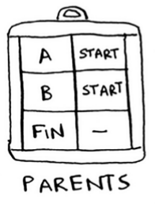
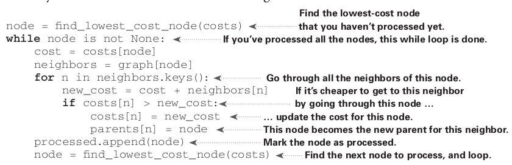
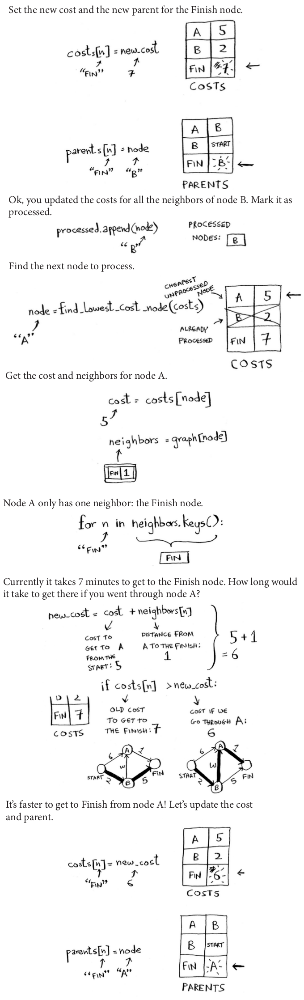

## Dijkstras Algorithm

- Dijkstra's algorithm, lets you answer "What's the shortest path to X?" for weighted graphs.

  

- Breadth-first search will find you the path with the fewest steps. What if you want the fastest path instead? You can do that fastest with a different algorithm called Dijkstra's algorithm.

- Dijkstra's algorithm has four steps:

  1. Find the cheapest node. This is the node you can get to in the least amount of time.
  2. Check whether there's a cheaper path to the neighbors of this node. If so, update their costs.
  3. Repeat until you've done this for every node in the graph.
  4. Calculate the final path. (Coming up in the next section!)

- Dijkstra's algorithm, each edge in the graph has a number associated with it. These are called weights. A graph with weights is called a weighted graph. A graph without weights is called an unweighted graph.

  

- Dijkstra's algorithm only works with directed acyclic graphs, called DAGs for short. In other words, Dijkstra's algorithm can not work with recurcive cycle graphs.

- You can't use Dijkstra's algorithm if you have negative-weight edges. Negative-weight edges break the algorithm.

## Implementation


- You'll update the costs and parents hash tables as the algorithm progresses. First, you need to implement the graph:

  ```python
  graph = {}
  ```

- This time, we need to store the neighbors and the cost for getting to that neighbor. For example, Start has two neighbors, A and B. How do you represent the weights of those edges? Why not just use another hash table?

  ```python
  graph["start]["a"] = 6
  graph["start]["b"] = 2
  graph["a"]["fin"] = 1
  graph["b"]["a"] = 3
  graph["b"]["fin"] = 5
  graph["fin"] = {}
  ```

- So graph["start"] is a hash table. You can get all the neighbors for Start like this:

  ```python
  >>> print graph["start"].keys()
  ["a", "b"]
  ```

- Next you need a hash table to store the costs for each node. The cost of a node is how long it takes to get to that node from the start. If you don't know the cost yet, you put down infinity. Can you represent infinity in Python? Turns out, you can:

  ```python
  infinity = float("inf")
  ```

- Here's the code to make the costs table:

  ```python
  infinity = float("inf")
  costs = {}
  costs["a"] = 6
  costs["b"] = 2
  costs["fin"] = infinity
  ```

- You also need another hash table for the parents:

  

- Here's the code to make the hash table for the parents:

  ```python
  parents = {}
  parents["a"] = "start"
  parents["b"] = "start"
  parents["fin"] = None
  ```

- Finally, you need an array to keep track of all the nodes you've already processed, because you don't need to process a node more than once:

  ```python
  processed = []
  ```

- I'll show you the code first and then walk through it. Here's the code:

  

- First, let's see this `find_lowest_cost_node` algorithm code in action:

  
  

- Once you've processed all the nodes, the algorithm is over. I hope the walkthrough helped you understand the algorithm a little better. Finding the lowest-cost node is pretty easy with the `find_lowest_cost_node` function. Here it is in code:

  

## Recap

- Breadth-first search is used to calculate the shortest path for an unweighted graph.
- Dijkstra’s algorithm is used to calculate the shortest path for a weighted graph.
- Dijkstra’s algorithm works when all the weights are positive.
- If you have negative weights, use the Bellman-Ford algorithm.
